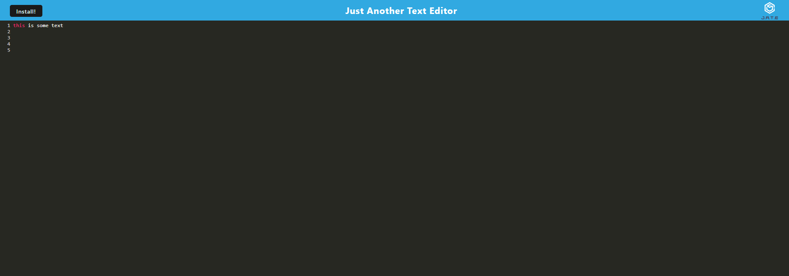

# Module 19 Challenge - Text Editor (PWA)

## Description of Work
Created a Text Editor application to create notes/code snippets regardless of internet connectivity status. This project is using JS and npm: express, concurrently, and nodemon.

## Final Screenshot

## Links
[GitHub](https://github.com/bpavlis/text-editor)

[Heroku](https://text-editor-bp-9dea36ce201f.herokuapp.com/)

## Additional Note
For this project, we were given a large amount of starter code and direction from our instructor. We were told to use this code and complete the areas that say TODO in the src-sw, webpack.config, database, and install JS files in the client folder. I have left in the TODO comments so that the grader may see where original code was supposed to be implemented. 